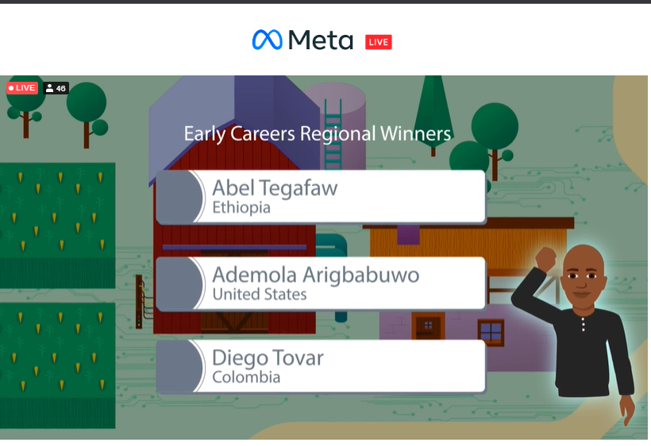

<h1 align="center">Hi there 👋🏼, I'm Ade</h1>
<h2 align="center">Full-stack Software Engineer currently based in Chicago, IL 🌁</h2>

- 🔭 I’m currently working building the new state of the art Kroger Ad Platform ;)

- 🌱 I’m currently learning **Gen A.I and Large Language Model**

- 💬 Ask me about **the Full Stack** and **Tennis**

- ⚡️ Fun fact: 
    - **I love watching/playing tennis, biking and learning new things**
    - **I won the 2022 Meta Global Hackathon for the United States Region**  
         
        

<h2 align="center">Connect with me 🤝 </h2> 

  

<h2 align="center">Languages and Tools 💾</h2>

 
  <!-- Front end frameworks -->
   
   
  

 
  <!-- Languages -->
  
    
   
  
  

<!-- Backend APIs -->

 
   
   
   
   
   
   

<!-- Cloud, Monitoring & Containers -->

 
  
  
  
  

<h2 align="center">GitHub Stats 🔗 </h2>

&nbsp;

